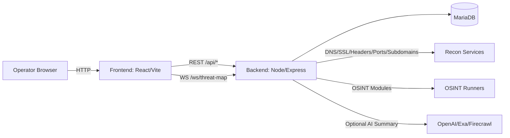

# Project Overview
Project Title: 
Lekirrax : An Ai-Driven Osint-Based Cyber Threat Intelligence And Analytics Sentinel System

Team Name: 
LekirraX

Team Members:
- MUHAMMAD HANIF BIN MOHAMAD NIZAM

Project Description: 
LekirraX is a full-stack cybersecurity platform for reconnaissance scanning, OSINT enrichment, and analyst-oriented reporting. It lets an operator submit a target (domain/URL), runs a multi-step recon pipeline (DNS/SSL/headers/ports/subdomains/firewall signals), enriches results with OSINT modules, optionally generates an AI executive summary, and persists scan history in MariaDB for later search, review, and export.

Problem solved and relation to the hackathon theme/challenges:
Security teams often run repeatable scans across many targets and struggle with (1) storing results consistently, (2) querying historical findings quickly, and (3) turning raw technical output into actionable remediation. LekirraX uses MariaDB as the system of record for scan snapshots and OSINT activity, enabling searchable history, pagination, indexing, and exportable investigations.

Technologies Used:
- Database: MariaDB
- Backend: Node.js (ES modules), Express, WebSockets (ws)
- Frontend: React (Vite), TypeScript
- Security middleware: Helmet, CORS, rate limiting, Joi validation, JWT
- Logging: Winston, Morgan
- Optional enrichment providers: OpenAI, Exa, Firecrawl (feature-disabled if keys are missing)
- Testing: Vitest, Testing Library, JSDOM

# Problem Statement
Challenge Addressed:
Build a solution that uses MariaDB effectively to store, query, and operationalize cybersecurity intelligence over time (scan results, OSINT evidence, and analyst workflows) while remaining performant and scalable.

Solution Overview:
- Persist scans, OSINT results, and analyst activity in MariaDB with indexed tables for history queries.
- Provide an operator UI to start scans and monitor completion via job polling.
- Provide OSINT modules that enrich targets and log investigations for auditability.
- Generate an optional executive summary (AI) and allow exporting the summary as Markdown.

Impact of Solution:
- Operational efficiency: analysts can rerun scans and compare outcomes via stored history.
- Traceability: OSINT investigations are stored with timestamps, sources, and error states.
- Extensibility: modular recon/OSINT services make it straightforward to add new checks without redesigning storage.

# Project Implementation
Architecture Diagram:

Detailed Explanation:
- Backend entry point: server.js exposes API routes for recon jobs, OSINT modules, history queries, recommendations, and the threat-map feed.
- Recon execution:
  - POST /api/recon/start launches an async job and returns jobId.
  - GET /api/recon/status/:jobId polls status until complete/cancelled/failed.
  - On completion, the backend persists a complete scan snapshot.
- MariaDB schema and persistence:
  - scripts/migrate.js creates core tables and indexes (scans, systems, ports, firewalls, ai_analysis, osint_results, osint_activity, users, user_interactions, recommendation_cache).
  - scans.page_content stores a full scan snapshot as JSON for “single-row snapshot” retrieval.
  - osint_activity is indexed by created_at/target/module/type/actor for fast filtering and export.
- History and export:
  - History endpoints return paginated results and detailed records.
  - OSINT history supports export in JSON/CSV.

Challenges Faced:
- Dependency compatibility: react-simple-maps peer requirements required aligning the frontend to React 18 for reproducible installs.
- Defensive scanning: input validation and SSRF guardrails require careful handling of URLs and reserved hostnames.
- Storage evolution: schema migration scripts add missing columns and indexes to support historical queries.

Future Enhancements:
- Expand OpenAPI coverage to include all endpoints (recon, OSINT, history, threat-map).
- Add CI workflow for test/lint/build verification on every push.
- Improve frontend bundle size via route-level code splitting.
- Replace mock login with DB-backed users and token/session revocation strategy.

# Code Repository
GitHub/Repository Link:
- https://github.com/MariaDB-Hackathon-MY-2026/lekirrax-osint-intelligence.git

Code Documentation:
- Root README.md documents setup, environment variables, and key routes.
- DEPLOYMENT.md documents deployment notes and recommended hardening.
- openapi.yaml documents the recommendations/interactions/users subset (partial API spec).
- scripts/migrate.js documents and enforces the MariaDB schema used by the platform.

# Judging Criteria Compliance
How the Project Meets the Criteria:
- Creativity: combines recon + OSINT + threat visualization + executive reporting into a single analyst workflow.
- Technical difficulty: asynchronous scan job orchestration, optional multi-provider enrichment, WebSockets threat feed, and structured persistence.
- Scalability: MariaDB indexes on scan timestamps, targets, and OSINT activity fields; pagination on history endpoints; caching for history queries.

Innovation:
- Stores full scan snapshots for quick retrieval while also supporting structured, indexed activity logs for auditability and filtering.
- Provides an “executive summary” export flow to turn raw scan evidence into shareable remediation guidance.

# Conclusion
Summary:
LekirraX delivers a MariaDB-backed OSINT and reconnaissance platform that helps analysts run scans, enrich targets, track historical activity, and export actionable summaries. The project demonstrates how MariaDB can support both snapshot storage and indexed operational querying for cybersecurity workflows.

Acknowledgments:
- Open-source ecosystem: Express, React, Vite, MariaDB, Vitest, and supporting libraries.
- Optional enrichment providers: OpenAI, Exa, Firecrawl (when configured).
