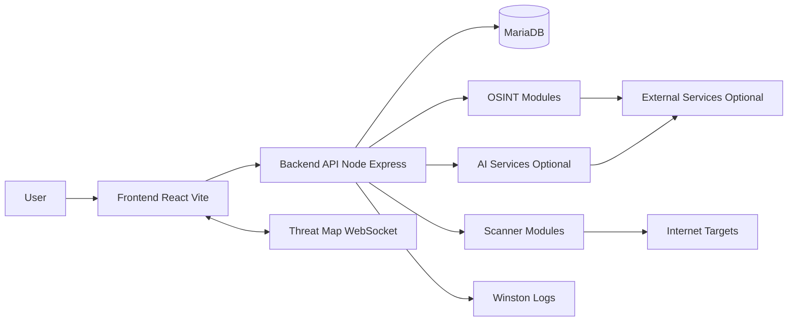

# Project Overview
Project Title: **LEKIRRAX: An AI-Driven OSINT-Based Cyber Threat Intelligence and Analytics Sentinel System**

Team Name: **LekirraX**

Team Members:
- **Muhammad Hanif Bin Mohamad Nizam** (solo project)

Project Description:
LekirraX is a full-stack cybersecurity platform for reconnaissance scanning, OSINT enrichment, and analyst-oriented reporting. An operator submits a target (domain/URL), the backend runs a multi-step recon pipeline (DNS/SSL/headers/ports/subdomains/firewall signals), enriches results with OSINT modules, optionally generates an AI executive summary, and persists investigation history in **MariaDB** for later review, search, and export.

Problem solved and relation to the hackathon theme/challenges:
Security workflows often rely on separate tools and browser tabs, making investigations hard to repeat and even harder to audit. LekirraX centralizes recon + OSINT evidence and stores the outputs in MariaDB so investigators can:
- Re-open previous scans,
- Compare outcomes over time,
- Export evidence for reporting,
- Maintain an auditable investigation trail.

Technologies Used:
- **Database:** MariaDB
- **Backend:** Node.js (ES modules), Express, WebSockets (`ws`)
- **Frontend:** React (Vite), TypeScript
- **Security:** Helmet, CORS, rate limiting, request validation, JWT auth
- **Logging:** Winston
- **Optional AI/Enrichment:** OpenAI, Exa, Firecrawl (feature-disabled if keys are missing)
- **Testing:** Vitest, Testing Library, JSDOM

# Problem Statement
Challenge Addressed:
Build a solution that uses **MariaDB** effectively to store, query, and operationalize cybersecurity intelligence over time (scan results, OSINT evidence, and analyst workflows) while remaining performant and scalable.

Solution Overview:
- Persist scans, OSINT results, and analyst activity in MariaDB with schema and indexes designed for history queries.
- Provide an operator UI to start scans and monitor completion via job polling.
- Provide modular OSINT runners that enrich targets and log investigations for traceability.
- Provide readable “Pretty” results with a Raw JSON view for transparency, plus export options.

Impact of Solution:
- Operational efficiency: rerun scans and compare outcomes using stored history.
- Traceability: investigations include timestamps, sources, and consistent result structures.
- Extensibility: modular recon/OSINT services make it straightforward to add new checks.

# Project Implementation

## Architecture Diagram

## Key Workflows
- Recon execution:
  - `POST /api/recon/start` launches an async job and returns `jobId`.
  - `GET /api/recon/status/:jobId` polls status until complete/cancelled/failed.
  - On completion, the backend persists a complete scan snapshot for History.
- OSINT execution:
  - `GET /api/osint/:module?target=...` runs a module and returns a structured result `{ module, risk, data }`.
  - Results are presented in Pretty view (for readability) and Raw JSON view (for verification).
- History and export:
  - History endpoints return paginated results and detailed records.
  - Stored entries can be deleted for data hygiene.
  - Exports are supported (JSON/CSV) for reporting workflows.

## MariaDB Data Model
LekirraX uses MariaDB as the system of record for investigation history:
- `scans`: main scan record; stores a full scan snapshot as JSON (used by the History details view).
- `systems`, `ports`, `firewalls`: structured recon outputs linked to a scan.
- `ai_analysis`: optional executive summary + structured vulnerabilities/remediation (JSON).
- `osint_results`: OSINT results linked to scans for reporting and History counts.
- `osint_activity`: audit log of OSINT runs (who ran what, target, module, time) with optional encrypted payload storage.
- `users`, `user_interactions`, `recommendation_cache`: operator identity and recommendation support.

If encryption is enabled, OSINT payloads can be stored as an encrypted envelope (AES-256-GCM) instead of plain JSON, improving privacy for sensitive investigations.

## Challenges Faced
- Dependency compatibility and reproducible installs across devices.
- Defensive scanning and validation (safe URL/hostname handling).
- Long-running OSINT requests (timeouts, rate limiting, and graceful failure handling).
- Storage evolution and migrations to support history queries and indexing.

## Future Enhancements
- Expand OpenAPI coverage to include all endpoints (recon, OSINT, history, threat-map).
- Add CI workflow for test/lint/build verification on push/PR.
- Improve bundle size and load time (route-level splitting).
- Extend optional provider integrations (breach intel, richer threat feeds) with clear opt-in settings.

# Code Repository
GitHub/Repository Link:
- https://github.com/MariaDB-Hackathon-MY-2026/lekirrax-osint-intelligence.git

Code Documentation:
- `README.md`: setup, prerequisites, quick start, environment configuration.
- `DEPLOYMENT.md`: deployment notes and recommended hardening steps.
- `openapi.yaml`: API documentation/specification for the platform (may be partial depending on version).
- `scripts/migrate.js`: schema creation and database bootstrapping logic.
- Test suites: unit tests for backend and frontend behaviors (Vitest).

# Judging Criteria Compliance (LekirraX)

## Problem Relevance / Impact
LekirraX addresses a common SOC workflow pain point: intelligence signals are scattered across tools, and investigations are difficult to repeat. By persisting scan snapshots and OSINT activity in MariaDB, the platform supports repeatable, auditable investigations and faster reporting.

## Innovation / Creativity
The system provides a “single investigation timeline” experience: recon + OSINT + optional executive summary + history storage in one workflow. The “Pretty view + Raw JSON” design improves readability without losing evidence fidelity.

## Technical Difficulty
The project combines multiple complex areas:
- Auth-protected APIs with validation and rate limiting.
- Async scan orchestration (job start + status polling).
- Modular OSINT runners with timeouts and failure handling.
- Structured persistence across multiple MariaDB tables and indexes.

## Security & Privacy
- JWT-protected endpoints, input validation, and rate limiting.
- Optional encryption-at-rest for OSINT payload storage.
- Provider keys are optional and should never be committed to the repository.

## Scalability / Performance
- Indexed MariaDB tables to support pagination and filtered history queries.
- Timeouts and caching to keep the system responsive under variable external conditions.
- WebSocket threat-map channel with HTTP fallback polling.

## User Experience / Demo Readiness
- Clear scan states and readable result cards.
- Pretty view for quick understanding, Raw JSON for auditability.
- History browsing to demonstrate repeatable investigations.

# Issue Breakdown (GitHub Issues)
Recommended issue set for planning and tracking:
1) System architecture documentation (diagram + data flow)
2) AI SOC analysis reliability + fallback rules
3) Database schema generation + migrations
4) History search/filter/query improvements + indexes
5) API hardening + OpenAPI spec expansion
6) UI/Dashboard polish + History UX improvements
7) Testing and validation coverage for critical flows
8) Deployment setup (optional Docker/CI) + production hardening checklist

# Conclusion

## Summary
LekirraX is a MariaDB-backed OSINT and Cyber Threat Intelligence platform designed to help analysts quickly gather, validate, and present actionable intelligence. By combining recon scanning, OSINT modules, readable reporting, and a persistent History timeline, the platform reduces investigation time and improves clarity while keeping evidence accessible for verification.

## Acknowledgments
- Supervisor/lecturer guidance and feedback.
- Classmates/friends who supported testing and review.
- My family for their unconditional support and encouragement throughout the project.
- Open-source ecosystem (React, Vite, Express, MariaDB, and supporting libraries).
- Documentation and tutorials that supported integration and debugging.
- MariaDB Hackathon Malaysia 2026 for the opportunity to showcase this project.

# Appendix (Environment Template)
Common variables:
- `PORT`, `NODE_ENV`, `ALLOWED_ORIGINS`
- `JWT_SECRET`
- `DB_HOST`, `DB_PORT`, `DB_USER`, `DB_PASSWORD`, `DB_NAME`
- Optional providers: `OPENAI_API_KEY`, `EXA_API_KEY`, `FIRECRAWL_API_KEY`, `WHOIS_API_KEY`
- Asset enrichment: `CENSYS_API_TOKEN` or (`CENSYS_API_ID` + `CENSYS_API_SECRET`), `SECURITYTRAILS_API_KEY`, `SHODAN_API_KEY`, `IPINFO_API_KEY`
- Phone enrichment: `PHONE_PY_LOOKUP`, `PHONE_PY_TIMEOUT_MS`
- Optional encryption: `OSINT_ENCRYPTION_KEY`
